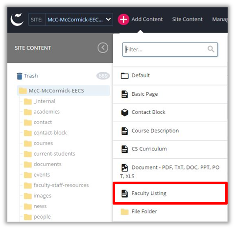
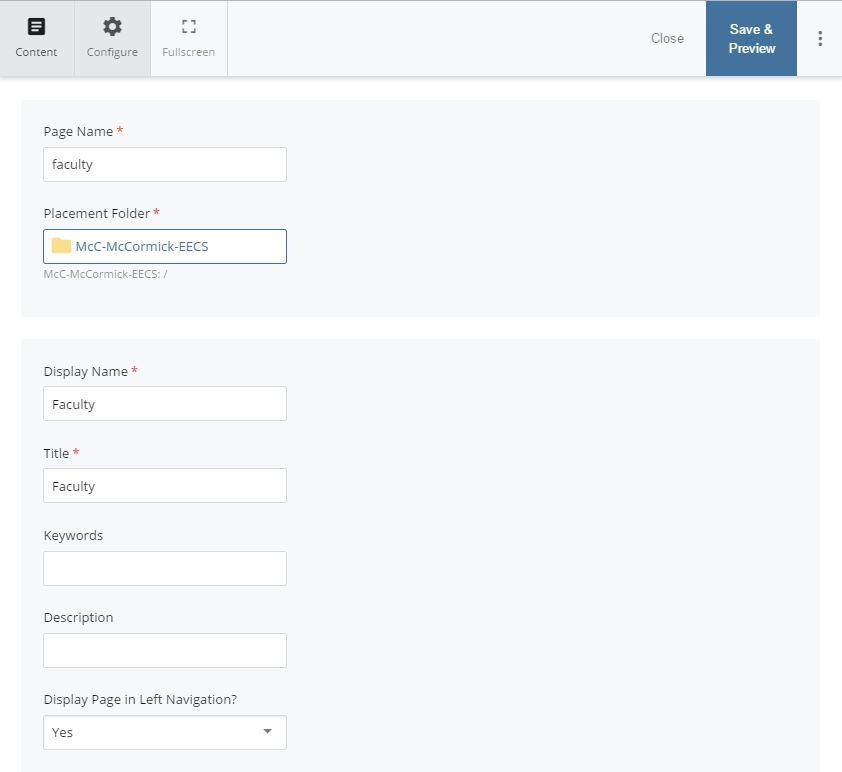
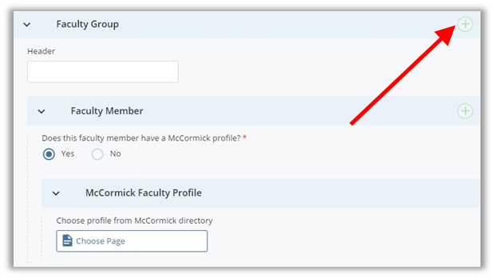
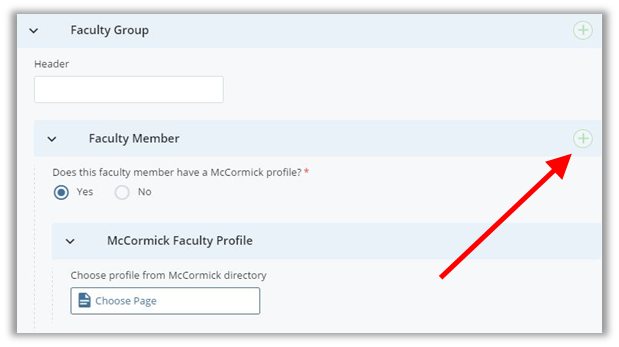
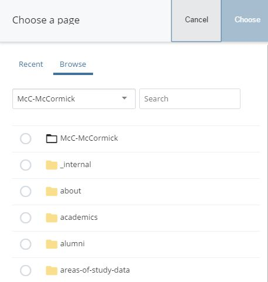
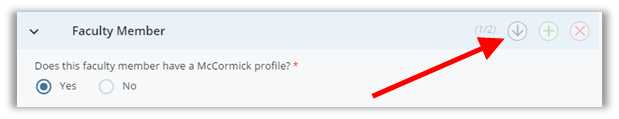

## Faculty Listing {#faculty-listing}

Faculty listing pages are a great way to feature your entire list of faculty in one place. These pages can feature faculty one of two ways:

*   Pull profile information from the main McCormick site
*   Enter relative information in fields for those people who do not have core or affiliated profiles on the main McCormick site.

Make sure that the faculty you want to have featured on your faculty listing page have profiles on the main McCormick site first (if applicable) before creating or making additions to Faculty Listing pages.

**Creating a Faculty Listing Page**

To create a faculty listing page, go to the toolbar and select “Add Content”. Select “Faculty Listing” from the dropdown menu.

After selecting the “Faculty Listing” option from the dropdown menu you will see the fields for your new page.

First, fill out the Page Name (all lower case, separated by hyphens) of your page. And, chose the Placement Folder i.e. the location in the website where this new page will exist. Remember, the Page Name becomes part of the page&#039;s url.

Next, fill out the inline metadata. Learn more on how to fill out this section in the &quot;

Include Metadata

&quot; subsection of this guide.

NOTE: Anything with a yellow star next to it has to be filled in before you can successfully submit and save the page (First Name, Last Name, Contact).

**Body Content**

The body content section allows you to insert important information before your faculty profiles. If there is anything important that a user needs to know before viewing your faculty members, insert it here.

**Faculty Groups**

**Adding Headers**

If you would like to format your page with different headers or groups all you have to do is **click on the green icon**  under the Faculty Group. This will add an additional header and will allow you to organize your faculty listing page.

For example, if you are creating a faculty listing page for your core, affiliated, and emeritus faculty you could organize them by creating three separate headers (Core Faculty, Affiliated Faculty, Emeritus Faculty).

**Adding Faculty Members**

You will most likely add several faculty members on this page, so it is important to know how to add additional faculty. **Click on the green icon** under Faculty Group &gt;&gt; Faculty Member.

Cascade is going to ask you if the faculty member has a McCormick profile. &quot;Yes&quot; will be selected by default. Click the section where it says &quot;Choose Page&quot;. A new window will open up to select a page.

This window is set to view pages on your department site. However, faculty profiles, both core and affiliated, are stored on the main McCormick site. To choose pages from the main McCormick site, **click “Browse” and** **search for &quot;McC-McCormick&quot; on the search bar**.

The navigation panel below will update to reflect the main McCormick site. Navigate to the &quot;**research-faculty**&quot; folder toward the bottom of the tree. Click the folder to expand it, and then click the &quot;**directory**&quot; folder. Core McCormick faculty profiles are stored in the &quot;profiles&quot; folder. Affiliated faculty profiles are in the &quot;affiliated&quot; folder.

Once, you&#039;ve found the individual page that corresponds to the faculty member, click it and then click &quot;Choose&quot;. The individual faculty member&#039;s information will now be included on your department&#039;s Faculty Listing page.

Every time you want to add another faculty member all you have to do is **click on the green icon**  and it will add another content field.

If the person you&#039;d like to feature does not have a McCormick profileand you cannot create an affiliated profile for him/her, you will have to enter their information on this page. Select &quot;No&quot; for &quot;Does this faculty member have a McCormick profile?&quot; and fill out the appropriate fields.

**Changing the Order of Faculty Members**

If you would like to change the order of the faculty you have created you have to **select the purple up or down arrow** that is located next to the addition icon. You can move faculty members up and down to organize your page alphabetically or by hierarchy.

**Sidebar**

Once you have your faculty members organized, fill out the sidebar information. This is one of the last steps to creating the page. Make sure to fill out the contact info (mandatory) along with any related links and call-outs.

Example:

**NOTE**: It is important to update this page when new faculty members join your team, when they change positions, or leave the department.

*You can link directly to a specific faculty member in the listing page by adding #firstname-lastname to the url. See &quot;Linking to People&quot; p. 58 for more details.

