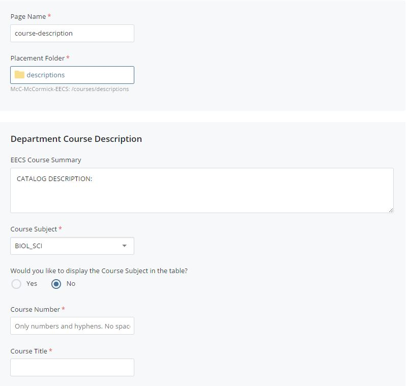
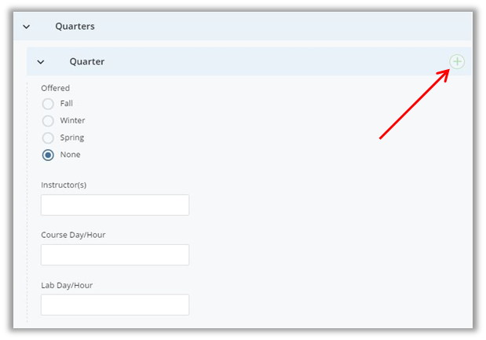
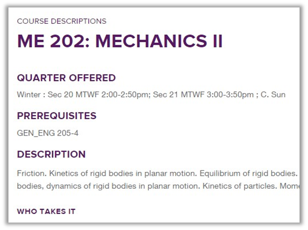

## Course Description {#course-description}

All course descriptions are stored in the &quot;courses/descriptions&quot; folder.

To create a new course description, go to Add Content &gt;&gt; Course Description. Update the Page Name, Display Name and Title fields. You cannot submit or save the page asset until these fields have been filled out.

Then, fill out the Quarters &gt;&gt; Quarter section for each quarter taught this academic year. Check the corresponding quarter in the **Offered** field. If it&#039;s not being taught this year, use one quarter section and select “None” for the **Offered** field. The Course Number and title will still appear in the table, but nothing will appear in the quarter fields. If you do not want the course to appear in the table at all, you can select “Configure” on top of the editing window and then uncheck &quot;Include with indexing.&quot; **Do not delete or move course assets once created.** Other sites may be linking to your assets and you should receive a warning indicating what pages are linked if you attempt to delete them.

To add another quarter, click the green plus icon .

Enter the prerequisites, course description text and attach any syllabi in the fields below the Quarters section. Information from these fields will be displayed only on the course page, not on the Course Listing.

For changes to the subject, title and quarters offered to appear, users should publish both the description page and Course Listing.

Example:

