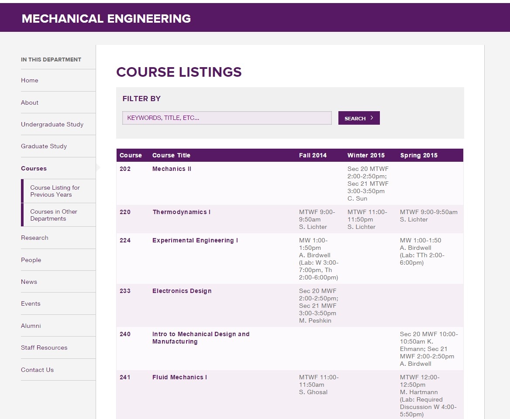
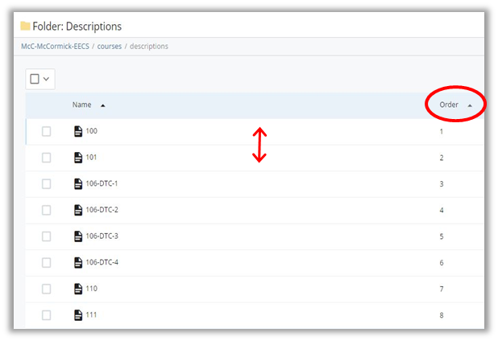

## Course Listing {#course-listing}

The Course Listing page displays a searchable index of all course descriptions entered in Cascade. Each row of the table corresponds to an individual course description page asset and includes a link to that asset. Introductory text, which will appear below the page title, can be entered on this page. All other information displayed here is pulled from the individual course description . This page should be republished anytime an individual course description is updated, added or removed.

The course order that appears in the table can be controlled through the Folder Order of the descriptions folder. To do this, select the descriptions folder and select &quot;Order&quot; in the new pane. The courses assets will display in the same order as the Course Listing. Reorder any course by clicking the area to the right of the course name and dragging it to a new position.

