## Faculty Profiles {#faculty-profiles}

Faculty profiles for all McCormick faculty – whether they are tenure-track, tenured, or clinical faculty with paid, budgetary appointments OR are affiliated faculty (e.g. department adjuncts, lecturers, emeritus, research faculty, courtesy appointments, etc.) – are kept in the **main McCormick site (McC-McCormick)** in Cascade:

**McC-McCormick / research-faculty / directory /**

**Budgetary / Tenure-track faculty profiles** are kept in the “**profiles**” sub-folder.

**Affiliated faculty profiles** are kept in the “**affiliated**” sub-folder.

### Budgetary / Tenure-track Faculty Profiles (e.g. Core faculty) {#budgetary-tenure-track-faculty-profiles-e-g-core-faculty}

Profiles for McCormick budgetary faculty are created by Jason Grocholski (j-grocholski@northwestern.edu).

Once the profile has been created, department staff may add to or edit the content at any time, with two exceptions:

*   Only Jason Grocholski may edit the official position **titles** of faculty members. Department staff should not change faculty titles in the McCormick faculty directory. To request a title change, email Jason (j-grocholski@northwestern.edu).
*   To change a faculty’s preferred **profile** **photo**, please email the ORIGINAL photo (the raw, uncropped image) to Christa Battaglia in the marketing department (c-battaglia@northwestern.edu). Marketing will then ensure that the photo is cropped and connected to the correct faculty profiles as needed.

If a faculty member has public information in the Annual Report system – including their CV, publication lists or detailed research descriptions – that information is automatically fed to their McCormick faculty profile in Cascade and will appear on the profile page, once the profile has been republished.

To edit that information, you’ll need to log into the Annual Report system. See below for more information about that process.

If a faculty member is not in the Annual Report system or they have not yet been added to it, then all their information is contained and managed from their profile in Cascade.

In either case, a faculty’s basic information (see the right box) is kept in their faculty profile in Cascade.

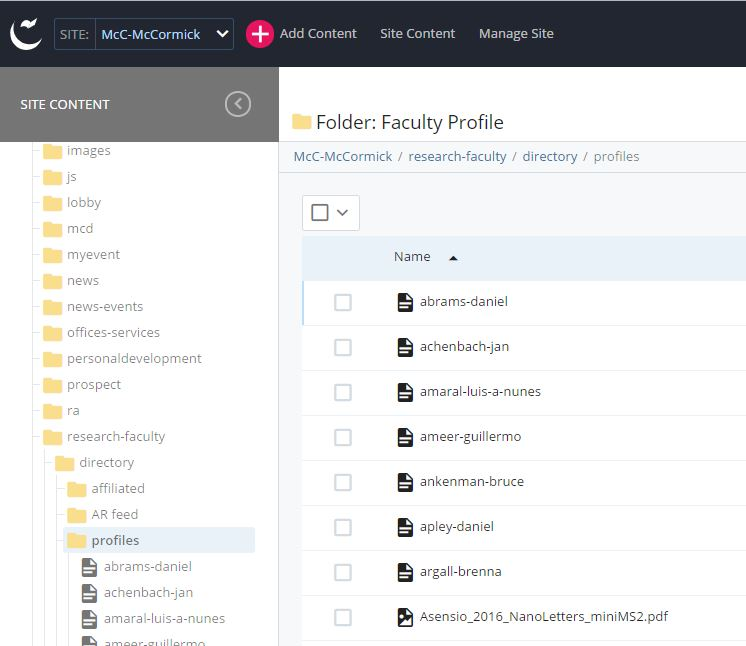

**Updating Basic Faculty Profile Information**

Department staff may edit faculty members’ basic information on their profile in Cascade, including:

*   name
*   contact information
*   affiliation
*   education
*   biography
*   research interests
*   significant recognition
*   significant professional service
*   patents

To edit a faculty profile, choose that person’s profile from the **“profiles”** folder and select “edit”.

Under the edit window, you may change their display name if needed (please format display name as “Last name, First name”).

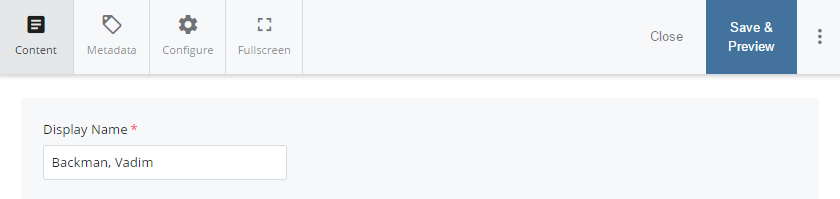

Under the Departments area, faculty profile should already be connected to their department(s).

If you need to add a new **department affiliation**, you may do so by using the “+” to add a new Department group. Choose the appropriate department from the drop-down menu.

**_Note_**_: The biography field can be used to add background and personal information not covered by other areas._

If this person is the **Department Chair**, select “yes” next to the question “Is this the Department Chair?”

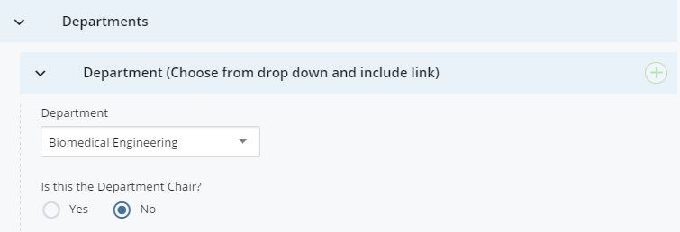

To enter **centers** with which the faculty member is involved, type them into the field under “Centers.” Use the “+” button to add additional centers.

To add or edit **education** information, enter it into the field called “Education”. Please be mindful of proper formatting, as this information will appear on the faculty profile exactly as it is entered into Cascade.

Fill out the field titledResearch Interests. This should be a brief summary of the interests, topics, or research area(s) that the faculty member practices. This content will appear on any pages that show faculty directory listings.

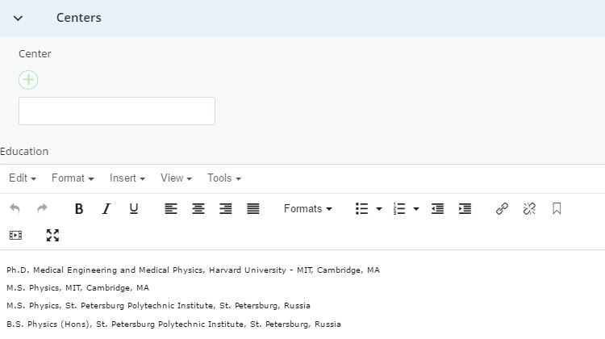

The next three sections enable you to list additional **optional** information for a faculty member:

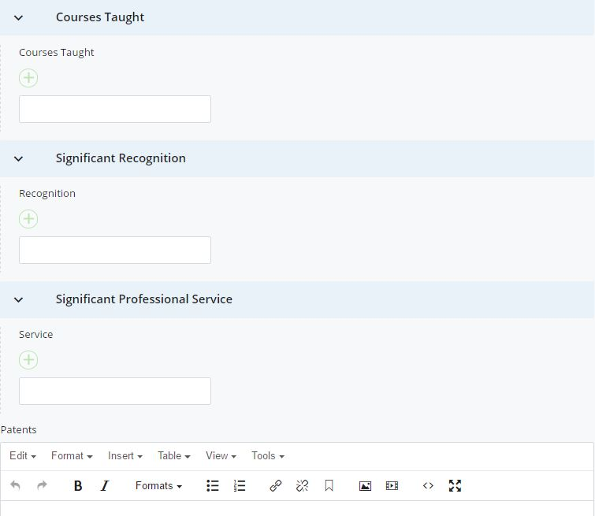

**Courses Taught** – the titles of any courses that faculty regularly teaches

**Significant Recognition** – the names/years of professional awards, honors or recognitions for that faculty member

**Significant Professional Service** – any roles or honorary positions held by the faculty member such as magazine editor or board member

For each of the above three areas, clicking the “+” button under each category will enable you to add another line of information. **For these fields, list only one item, achievement, or recognition per line.**

Use the **Patents** field to list or describe any relevant patents filed or held by the faculty member. Please be mindful of proper formatting, as this information will appear on the faculty profile exactly as it is entered into Cascade.

**Other Information** is an area where you can show any additional information for that faculty member, such as “In the Classroom” to explain their teaching philosophy. Again, please be mindful of proper formatting, as this information will appear on the faculty profile exactly as it is entered into Cascade.

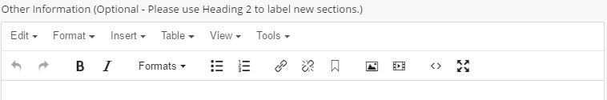

**Featured Items**

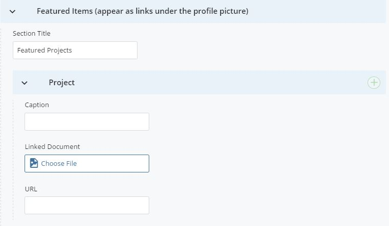

This section is an optional area that allows you to include additional documents or links on a faculty profile. It will display on the left side of the profile, underneath the faculty’s profile photo.

**Section Title** creates a title for the whole area (e.g. “Featured Projects” or “Publications”).

**Caption** is where you should enter the text that will appear on that link, such as “View a list of projects” or “Download a complete list of publications”

**Linked Document** is where you can use the page chooser icon to select a PDF or other file to link to.

You also have the option of putting a website address in the **URL** field, instead of choosing a PDF or other file, if you’d like to link off to an external website. Use the  or  icons to add or remove additional documents or links in this area.

**Updating Annual Report**

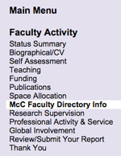

Faculty CVs, publication lists, and detailed research descriptions are kept and managed in the **&quot;McC Faculty Directory Info&quot;** section of the Annual Report. **This content is accessible and editable by faculty and department staff at any time throughout the year**.

Edit this information by logging into the [**Annual Report**](https://ar.mccormick.northwestern.edu/signin.php)([**https://ar.mccormick.northwestern.edu**](https://ar.mccormick.northwestern.edu/signin.php)) and clicking on &quot;McC Faculty Directory Info&quot; in the left sidebar. Department staff may need to select &quot;McC Faculty Directory Info&quot; again, once you have chosen the faculty member&#039;s name.

### Affiliated Profiles {#affiliated-profiles}

Academic department staff may create a new affiliated faculty profile at any time. All Affiliated Profiles are kept under the **McC-McCormick** Site Name folder.

**Creating a new Affiliated Profile**

To create a faculty listing page, select the affiliated faculty folder in **research-faculty/directory**.

Next, click “Add Content” on the Cascade sidebar as seen below. Select “Affiliated Faculty Profile”.

**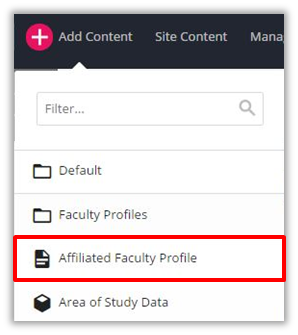**

After you select the “Affiliated Faculty Profile” page it will bring you to your new page. Make sure that your new page is kept under the **research-faculty/directory/affiliated** placement folder. **Note** that all the Affiliated Faculty profiles have to be saved in that placement folder.

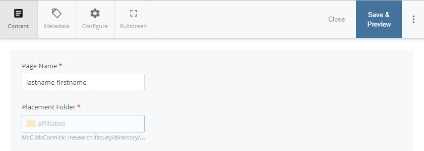

**Inline Metadata**

Next, you have to fill out the Inline Metadata. This includes the Display Name, Keywords, and Description. Make sure your Display name is formatted as Last Name, First Name.

**Content**

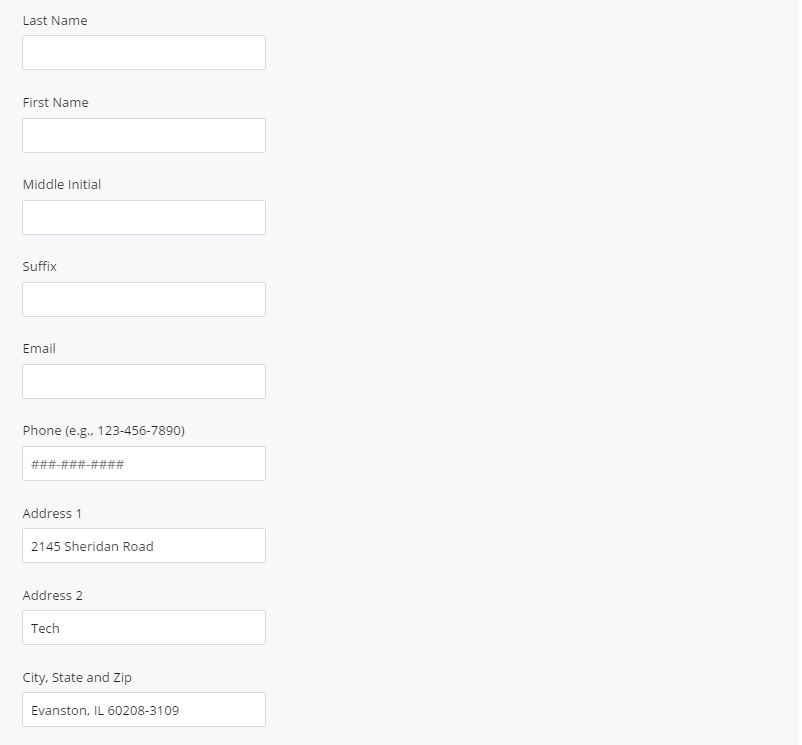

Please fill out as many fields as possible. Obviously, some are more important than others (name, email) but we encourage you to fill out as much as possible in order to let the user get important information about the affiliated faculty member.

Also, if the affiliated faculty member has a profile photo please attach it. Make sure you have already uploaded the photo/photos in Cascade before attaching them on this page.

**Images**

All profile photos associated with affiliated profiles should be **stored in &quot;images/research-and-faculty/directory/affiliated&quot; on the McC-McCormick site**. Not your department site. Go to Add Content &gt;&gt; Image – Affiliated Faculty – JPG PNG to add images. They will default to the proper location on the McCormick site. The image size is 250px X 250px as noted in the profile photo field.

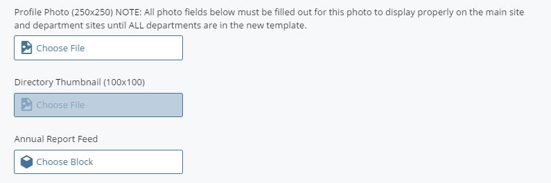

**Additional Content**

Cascade offers the following options:

***NOTE**: You do not have to fill out all of these fields but we encourage you to fill out the fields that are important to the faculty member.

**Titles:** Please fill out the Job Title(s) of the Affiliated Faculty Member.

**Departments:** Please select the dropdown menu and select the department that the faculty member is associated with.

**Affiliations**: If the faculty member is affiliated with a Master’s of Science program, please select the dropdown menu and the corresponding program.

**Websites:** If the faculty member has a research website or personal website please paste in the URL and text.

**Centers:** If the faculty member has any research centers please enter the name of that center accordingly.

**Education**: Please enter which degrees the professor has earned, along with the school and year. (Ex: BS Mechanical Engineering, Johns Hopkins University, 2007)

**Biography:** Please fill out basic biographical info for this faculty member not covered by the other sections in here. See pg. 68 for more information.

**Research Interests:** Please fill out the faculty member’s research interests.

**Publications:** If the professor has any selected publications please note them here.

(Ex: Wilson, A. D., J. A. Schultz, and T. D. Murphey, _&quot;Trajectory Optimization for Well-Conditioned Parameter Estimation&quot;_, IEEE Transactions on Automation Science and Engineering, vol. PP, issue 99, In Press.)

*Also, if the faculty member has a CV or Publications list you can upload them in this section.

**Courses Taught**: If the faculty member is teaching any specific course fill them out in this field.

**Significant Recognition:** If the faculty member has won any awards, or received any significant recognition, please fill it out here.

**Significant Professional Service:** If the faculty member has any significant professional service, fill it out accordingly.

**Patents:** If the faculty member has any patents list them in the text box.

**Featured Items:** If the faculty member has any projects they’d like to feature, please fill out the project title, the caption, the document or the URL. This will appear directly under their profile picture.

Example:

