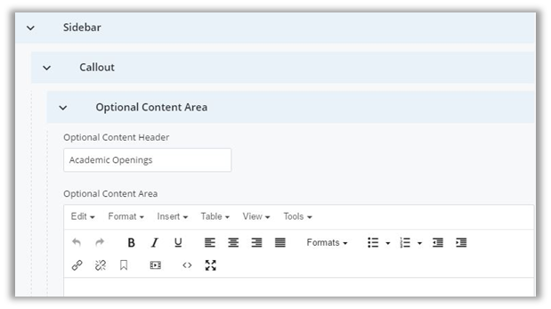

## Homepage {#homepage}

On the Department Homepage, there are many regions that are automatically updated or filled in for you. The regions outlined in red are those which you can edit. Detailed explanations on how all the regions function follow.

1.  Feature Slideshow
2.  Main Content
    1.  Introduction Area
    2.  Area of Study WYSIWYG
3.  Sidebar
    1.  Top News
    2.  Callout &amp; Optional WYSIWYG
    3.  Social Media

### Feature Slideshow {#feature-slideshow}

The Feature Slideshow on the department homepage includes features you create and McCormick news articles (which marketing will add to your site). The slideshow can feature **up to six slides**. It has the same controls as the basic page slideshow. You can choose to randomize which slide appears first when the page loads, automatically advance the slides and modify the intervals between each rotation.

When adding a new slide choose &quot;Department Feature&quot; as Slide Source. Fill out all the appropriate fields for the slide including:

*   Link Type
*   Internal or External Link
*   Headline – Displays in bold, capitalized letter across the bottom half of the slide
*   Float Text – To select whether the text floats above the left or right side of the slide image. If the subject of your photo is on the one side, you should likely float the text on the opposite side.
*   Summary – Displays below the headline in normal text at the desktop size. It does not display at mobile sizes. 150 character maximum!
*   Link Text – This should be a short action for your readers such as &quot;learn more&quot;. The link text defaults to &quot;read more&quot; if no other text is entered.
*   Image – **This image must be cropped to 990 x 435 px!**
*   Alternate Text – This text describes what&#039;s inside the image for search engines and does not display.

You&#039;ll notice that some slides have been filled out for you and have a source of &quot;McCormick News&quot;. You have full control to edit these slides. Edit the Headline text in the appropriate field. If you&#039;d like to edit anything else about the slide, select “Yes” for &quot;Do you want to change the Summary, Image, etc?&quot; and the fields for those items will appear for you to edit.

Add slides with the green plus icon  that appears at the top left. Remove them with the red minus icon and reorder slides with the blue arrows.

### Main Content {#main-content}

The main content area on the department homepage is made up of all the content in the left column under the slideshow. It includes an introduction area, areas of study tables and WYSIWYG content sections below each table.

#### Introduction Area {#introduction-area}

Content is entered in the Introduction Area of the homepage through a WYSIWYG editor. You can include text, links, images and more in this area.

#### Areas of Study Tables {#areas-of-study-tables}

The Areas of Study Tables include any undergraduate, graduate and affiliated programs for your department. These tables are automatically placed on your homepage. If you have an edit for these tables, email web-updates@mccormick.northwestern.edu.

#### Areas of Study WYSIWYG {#areas-of-study-wysiwyg}

You can include content related to your department programs below each areas of study table. To do this, select &quot;Yes&quot; for &quot;Include optional __ programs content (if applicable)&quot; in the corresponding main content region. The fields in the graphic below correspond to the area below the Undergraduate Programs table. You cannot include any media (images/video) in these areas.

### Sidebar {#sidebar}

The sidebar area on the department homepage is made up of all the content in the right column under the slideshow. It includes recent news, optional content areas, events and social media.

#### News {#news}

The homepage news feed will **automatically** feature the **latest four news stories** created by your department or created by McCormick marketing and tagged for your department. This will keep fresh news content on your homepage without a need to manage it. However, if you&#039;d like to feature news in this area at the top of the list that is not being pulled in automatically, you have the option to create **up to two Top News** **items** from the homepage edit window.

Fill in the text to display in the Link Text field and the link details in the Link Type fields. Remember, only four total news items can display at once. So, any added here will remove one from the bottom of the feed.

#### Callout &amp; Optional WYSIWYG {#callout-optional-wysiwyg}

A Callout is the purple arrow with text in the sidebar. To include one, select Sidebar &gt;&gt; Callout. Fill in your text in the WYSIWYG editor and then fill out the link details below. The callout is optional and content below will move up in the sidebar if one is not included.

The other optional area for custom content in the sidebar displays a purple header and text below. To enter content in this area, select Sidebar &gt;&gt; Callouts &gt;&gt; Optional Content Area. Enter the Header text in the Header field and the text in editor window below.

Content below the optional WYSIWYG will move up in the sidebar if no content is entered.

#### Social {#social}

The social media accounts added to the homepage also display on the News Index and News articles of the department site. To add new social media, select Sidebar &gt;&gt; Social. Select the type of service from the drop down and then enter the username. The appropriate icon will appear on the appropriate pages.

