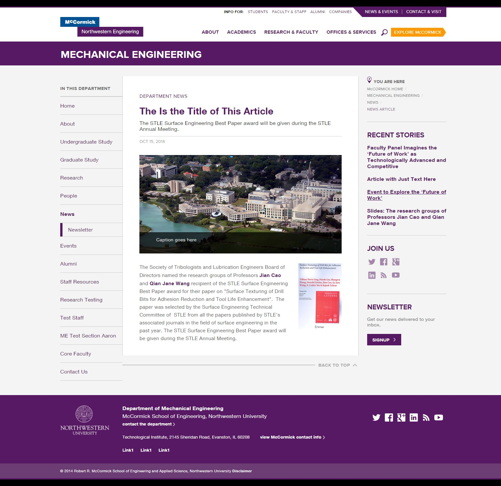
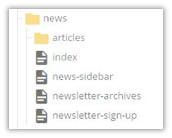
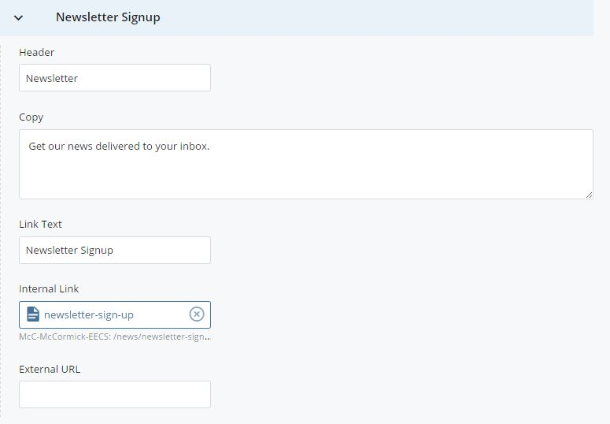

## News Article Sidebar {#news-article-sidebar}

Below is a sample news article on the Mechanical Engineering site. The right sidebar of every department news article displays the **four of the most recent news stories** from a pool of McCormick marketing articles tagged for the specific department and original articles from the department. Links to the stories appear in reverse chronological order.

The &quot;Join Us&quot; section in the sidebar display&#039;s the department&#039;s social media and is controlled from the department&#039;s homepage. Below that is a region to link to a news related item such as a newsletter signup. The Header, Copy, Link Text, and Link can all be customized. This bottom area is the only region in the sidebar you have control to edit.

You can edit these fields in the **news/news-sidebar** asset.

