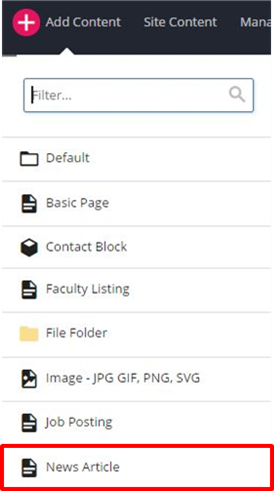

## News Articles {#news-articles}

There are two options for publishing news related to your department: create an internal article or link out to an external URL for news items that exist on other websites. Previously, there was a third option to pull a main McCormick site article into your department site. This is now an automatic process and McCormick articles tagged for your department will automatically show up in the news feed.

News articles are stored in news/articles/[year]. New articles created are stored in this location by default.

To create a department News Article, go to Add Content News Article

Update the Page Name field with appropriate text (lowercase and hyphens between words). Give the article a Title and Summary. The Title appears at the top of the article. The Summary does not appear on the article page. Rather, it appears in the news feed displayed on the department news index page and homepage.

The keywords and description fields are for search engines. Follow the same rules as the basic page for these fields.

The Start Date will appear on the article under the Subtitle and it indicates when the article can be indexed and published.

The URL field should only be filled out if the news asset will link out to a news source that is external to the McCormick website. If so, the web address, beginning with &quot;http&quot; should be entered here.

The second option is to create an original article. In this case, all of the fields mentioned above **EXCEPT the URL field** should be filled out. Then, content should be entered in the **Department News Article** area.

The **Subtitle** appears on the news article page under the Title on the news article (followed by the date). The text of the article should be entered in the **Story Content** area. An original article can feature a header image, slideshow or video. To enter media, click the **Featured Media** section to expand and then click on the Video or Images option. **NOTE**: these options are mutually exclusive.

If Video is chosen, select &quot;Yes&quot; for &quot;Would you like to embed a feature video?&quot; and then follow the instructions for &quot;

Inserting Video on Page

&quot;

Captions are required for all featured video and images. The fields for the header image or slideshow are set up in the same way as those for the basic page. Note the different sizes for the slideshow images.

If you are planning to share this news article to Facebook, please add a 200px x 200px image file to the Thumbnail Image field at the top of this region. This image will be shared alongside the article title, subtitle and link on Facebook.

If you have a related link, enter the text and url in the appropriate fields.

It will display at the bottom of the article in this style: 