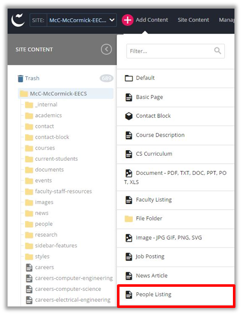
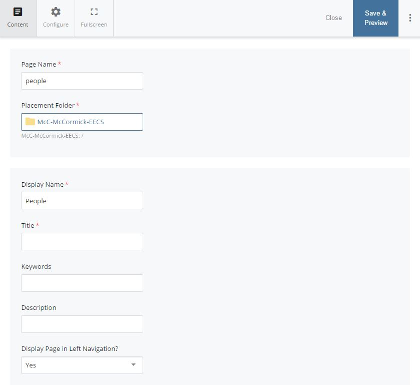
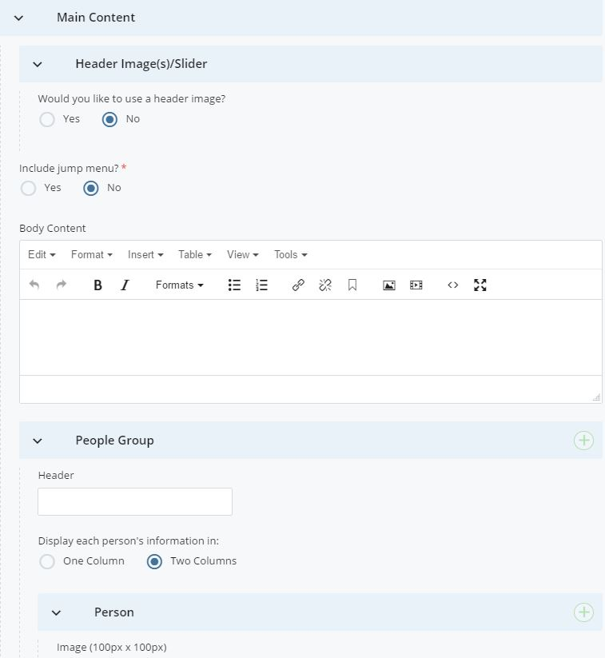
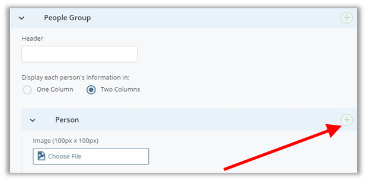
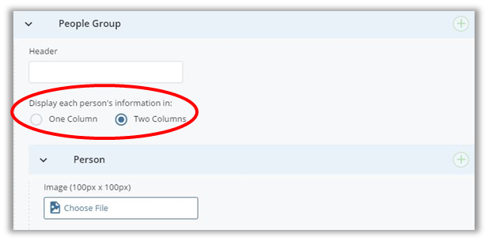
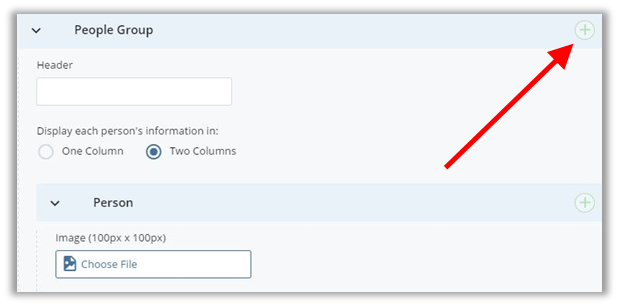
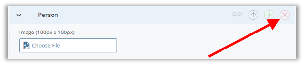
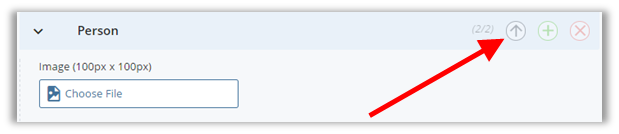
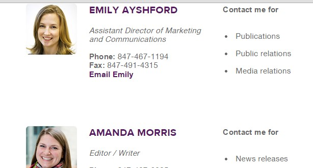

## People Listing {#people-listing}

People listing pages are a great way to feature anyone in your department (faculty, staff, students). They allow you to upload an image of that person, along with their contact information, and a description of what they do for your department.

To create a people listing page first go up to your toolbar in the content page and select “Add Content”. After selecting the dropdown menu select “People Listing”.

After selecting the “People Listing” option from the dropdown menu you will be transferred to your new page.

First, fill out the Page Name (all lower case, separated by hyphens). And, choose the Placement Folder i.e. the location in the website where this new page will exist. Remember, the Page Name becomes part of the page&#039;s url.

Next, fill out the inline metadata. Learn more on how to fill out this section in the &quot;

Include Metadata

&quot; subsection of this guide.

**NOTE**: Anything with a yellow star next to it has to be filled in before you can successfully submit and save the page (First Name, Last Name, Contact).

**Main Content**

The People Listing page has the same options for a header image/slideshow, jump menu and body content as a regular page. However, if you do not need to include any content before the listing of people then you can start entering content in the People Group area.

This is where you will be adding people, uploading their images, describing their role, and filling out contact information.

Attach a **photo cropped 100px by 100px** of the person you&#039;d like to feature. Remember, images must be cropped and uploaded to Cascade **before** editing the listing page.

Fill out the first name, last name and any other additional information that you would like. We suggest filling out all fields if possible.

**Adding Groups**

****

If you would like to format your page with different headers or groups all you have to do is **click on the green plus icon** under Main Content &gt;&gt; People Group. This will add an additional header and group to insert and organize photos.

For example, if you are creating a people listing page for your master’s and PhD students you could organize them by creating two separate headers (Master’s Students, PhD Students).

**Layout Options**

You have the option to display people&#039;s information (to the right of their image) in one or two columns for each group you add to the page. The layout defaults to two columns. You may want to use only if two columns may be severely uneven.

**Adding People**

****

You are most likely going to have several people listed on this page, so it is important to know how to add additional people. All you have to do is **click on the green plus**

**Icon** under Main Content &gt;&gt; People Group &gt;&gt; Person.

Every time you want to add another person all you have to do is **click on the green plus icon**  and it will add another content field.

**Deleting People**

****

If you have added too many people or have a person who is no longer with your department all you have to do is **click the red icon ** on that person’s content area.

**Changing the Order of People Listed**

****

If you would like to change the order of the people you have created you have to **select the purple down or up arrows**. You can move people up and down to organize your page alphabetically or by hierarchy.

**Sidebar**

The sidebar regions of this page are the same as the basic page type. You must at least fill in contact information before submitting the page.

**Example:**

**NOTE**: It is important for you to update this page when people change positions, leave the department, or get additional responsibilities.

****

**Linking to People**

If you have many people listed on your page, you may want to link directly to a person rather than make a website visitor browse the entire list to find a specific person. To link directly to a person on your people page, at the end of the page&#039;s url, add a hash mark # followed by the first and last name of the person in all lowercase letters and separated by hyphens:

**url.html#firstname-lastname**

Our example page is the McCormick marketing contact page at [http://www.mccormick.northwestern.edu/marketing/contact-our-team/index.html](http://www.mccormick.northwestern.edu/marketing/contact-our-team/index.html). To link directly to Emily Ayshord, we&#039;d add #emily-ayshford to get [http://www.mccormick.northwestern.edu/marketing/contact-our-team/index.html#emily-ayshford](http://www.mccormick.northwestern.edu/marketing/contact-our-team/index.html). Now, when we follow this url, the page view starts right above Emily&#039;s details:

**IMPORTANT**: **If the person has any spaces within their first or last name, replace that space with a hyphen and keep all punctuation!**

For example, to link to a person whose first name is &quot;J. Edward&quot; and last name is &quot;Colgate&quot;, the hash you&#039;d add at the end of the url would be #j.-edward-colgate.